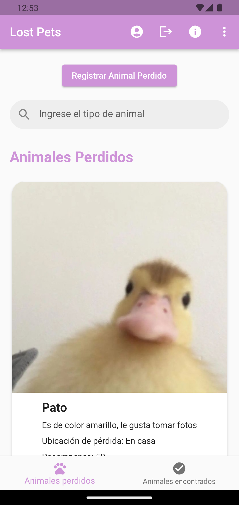

# Lost Pet - Aplicación para Animales Perdidos

¡Bienvenido a Lost Pet, la aplicación móvil que te ayuda a encontrar a tus mascotas perdidas o a darle un nuevo hogar a los animales encontrados!

## Descripción General

Lost Pet es una aplicación móvil desarrollada con Flutter, una tecnología versátil que permite crear experiencias de usuario atractivas y consistentes en iOS y Android. La aplicación se centra en la búsqueda y reunión de animales perdidos con sus dueños, así como en la posibilidad de adoptar animales encontrados.

## Características Principales

### Autenticación
- La aplicación cuenta con un  sistema de autenticación que incluye pantallas de inicio de sesión y registro. Se ha implementado el patrón BLoC para gestionar el flujo de datos de manera eficiente.

  
  

### Interfaz de Usuario Intuitiva
- La pantalla principal (home) presenta un diseño claro con un AppBar que contiene un botón de perfil, información sobre el equipo detrás de Lost Pet (About Us) y un menú que permite filtrar animales por categorías. También incluye un botón para cerrar la sesión del usuario.

  
  

### Exploración y Búsqueda
- Se ha implementado un scaffold que permite agregar nuevos animales perdidos o encontrados. La interfaz incluye un campo de búsqueda por nombre para facilitar la interacción del usuario.

  

### Categorización
- La aplicación organiza los animales en dos secciones: "Animales Perdidos" y "Animales Encontrados". Cada sección tiene sus propias funcionalidades y muestra la información básica de los animales en tarjetas (cards).

  

### Detalles de Animal
- Al tocar una tarjeta, se presenta una vista detallada del animal con botones interactivos para interactuar con la publicación, como contactar, eliminar o cambiar su estado a "Encontrado".

  

### Registro de Nuevo Animal
- La función de agregar un nuevo animal dirige al usuario a un formulario de registro con campos específicos para recopilar información detallada sobre el animal. Esto facilita la creación de publicaciones completas y detalladas.

  

## Tecnologías Utilizadas

- **Flutter:** Framework de desarrollo de aplicaciones móviles multiplataforma.
- **Patrón BLoC:** Utilizado para gestionar el estado de la aplicación de manera eficiente.

## Instalación

1. Clona este repositorio: `git clone https://github.com/Ferrufino03/Lost_pet.git`
2. Accede al directorio del proyecto: `cd LostPet`
3. Instala las dependencias: `flutter pub get`
4. Ejecuta la aplicación: `flutter run`

## Licencia

Esta aplicación está bajo la Licencia MIT. Consulta el archivo [LICENSE](LICENCE.txt) para más detalles.

## Equipo
Contacto: [lostpetanimal@gmail.com]
---

¡Esperamos que Lost Pet sea de gran utilidad para la comunidad amante de los animales! Si tienes sugerencias o encuentras problemas, ¡no dudes en comunicárnoslo!